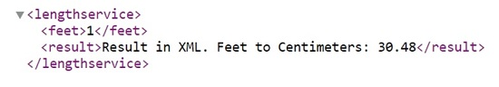

# RESTfulApp
This is a Restful Service which contains several web services that return their response in both JSON and XML:

> JSON result samples  
 {"Celsius Value":100,"Fahrenheit Value":212}  
 {"Celsius Value":150,"Fahrenheit Value":302}  
 {"Celsius Value":200,"Fahrenheit Value":392}

## Additional Description
This Restful Service was developed in Java using using Apache Tomcat as the web server:

For even more information, please refer to the file [Application-Guide.pdf](./Application-Guide.pdf)  
 

## References
Crunchify article[^1]
[^1]: https://crunchify.com/
